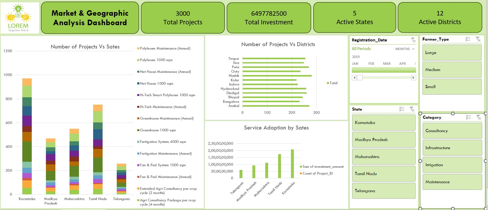
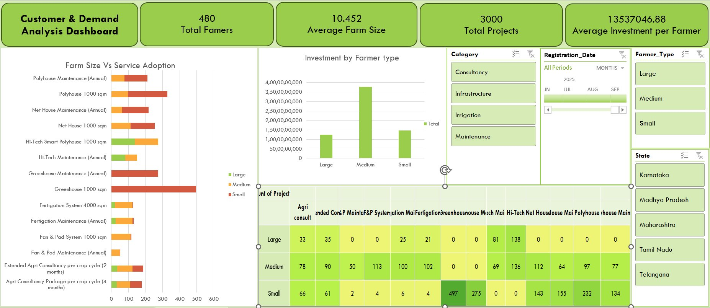
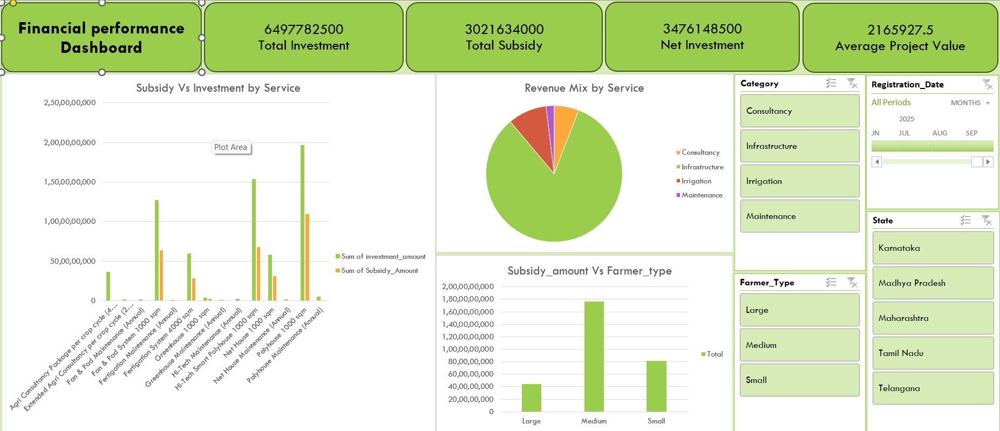
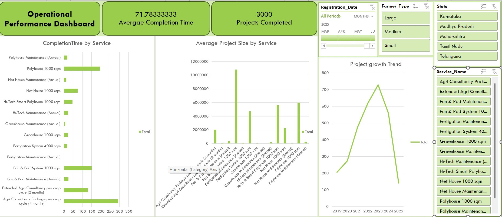

# Agri Business Analytics Dashboard — Excel Project

[](https://microsoft.com/excel)
[]()
[]()
[]()
[]()
[]()

---

## Business Context

> **As a data analyst at an Agri-tech startup, how can project and investment data be used to optimise service targeting, improve operational delivery, and guide strategic decisions across farm infrastructure services in five Indian states?**

This project transforms raw agricultural business data into **4 interactive Excel dashboards** covering market geography, customer segmentation, financial performance, and operational efficiency — answering 19 business questions using Pivot Tables, Pivot Charts, Calculated Fields, and Slicers.

> **Dataset note:** All three datasets were created from scratch using structured business logic and domain knowledge from prior industry experience. No data was sourced from any public repository.

---

## Key Metrics at a Glance

| KPI | Value |
|---|---|
| **Total Investment** | ₹64,97,78,250 |
| **Total Subsidy** | ₹30,21,63,400 |
| **Net Investment (Farmer-Borne)** | ₹34,76,14,850 |
| **Average Project Value** | ₹2,16,592.75 |
| **Average Completion Time** | 71.78 days |
| **Total Projects Completed** | 3,000 |
| **Total Farmers Onboarded** | 480 |
| **Average Farm Size** | 10.452 acres |
| **Average Investment per Farmer** | ₹1,35,37,046.88 |
| **Active States** | 5 |
| **Active Districts** | 12 |

---

## 🔗 Detailed Analysis — Click Any Section

| # | Section | What It Covers |
|---|---|---|
| 1 | [Dataset Description](01_dataset_description.md) | All three tables, field definitions, segmentation logic, subsidy rules |
| 2 | [Business Questions & Excel Analysis](02_business_questions.md) | All 19 business questions answered with methods and findings |
| 3 | [Key Insights](03_key_insights.md) | 7 major analytical findings backed by data |
| 4 | [Dashboard Details](04_dashboards.md) | All 4 dashboards — KPIs, charts, slicer setup, how to interact |
| 5 | [Recommendations](05_recommendations.md) | 6 actionable business recommendations with priority ranking |

---

## Problem Statement

**Polyhouse ROI & Investment Analysis**

An Agri Startup specialising in Polyhouse construction, irrigation systems, and consultancy services for farmers across multiple districts requires data-driven insights on:

- Investment performance and ROI across service categories
- Seasonal trends in service demand (Kharif, Rabi, Summer)
- Farmer segmentation and technology adoption patterns
- Regional market penetration across states and districts
- Subsidy utilisation and its impact on project adoption
- Operational efficiency and project completion timelines

**19 Business Questions answered in this project:**

| # | Business Question |
|---|---|
| Q1 | Total Revenue Generated |
| Q2 | Average Project Completion Time |
| Q3 | Monthly Investment Trends (2023) |
| Q4 | Top Services by Revenue |
| Q5 | Average Farmer Investment |
| Q6 | Revenue Comparison by Season |
| Q7 | Top 10 Districts by Number of Projects |
| Q8 | Investment Amount vs Completion Time |
| Q9 | Category-wise Revenue Contribution |
| Q10 | Farmer Type Adoption by Season (Kharif, Rabi, Summer) |
| Q11 | Farmer Segment with Highest Subsidy Support |
| Q12 | Districts with Highest Project Demand |
| Q13 | Services Preferred by Each Farmer Segment |
| Q14 | Average Project Investment per Service |
| Q15 | Services with Longest Completion Time |
| Q16 | How Project Demand Evolved Over Time (2019–2025) |
| Q17 | Subsidy Coverage Proportion per Service |
| Q18 | Popular Services by State |
| Q19 | How Farm Size Influences Technology Adoption |

---

## The Four Dashboards

---

### Dashboard 1 — Market & Geographic Analysis

**Purpose:** Identify regions with the highest infrastructure adoption and understand market penetration across states and districts.



**Key Metrics:**

| KPI | Value |
|---|---|
| Total Projects | 3,000 |
| Total Investment | ₹64,97,78,250 |
| Active States | 5 |
| Active Districts | 12 |

**Charts included:**
- **Number of Projects vs States** — stacked bar showing project volume and service mix per state (Karnataka leads with ~960+ projects)
- **Number of Projects vs Districts** — horizontal bar of top 12 districts (Tirupur, Sira, Pune, Ooty, Nashik, Kolar, Indore, Hyderabad, Dindigul, Bhopal, Bangalore, Anekal)
- **Service Adoption by State** — bar chart comparing investment volume and project count per state

**Slicers:** Registration Date · Farmer Type · State · Category

**Key Finding:** Karnataka leads with the highest project count (~960), followed by Tamil Nadu (~745), Maharashtra (~550), Madhya Pradesh (~475), and Telangana (~270). Southern states drive ~65% of all agri-tech infrastructure adoption.

---

### Dashboard 2 — Customer & Demand Analysis

**Purpose:** Understand which farmer segments drive demand and how farm size influences technology adoption choices.



**Key Metrics:**

| KPI | Value |
|---|---|
| Total Farmers | 480 |
| Average Farm Size | 10.452 acres |
| Total Projects | 3,000 |
| Average Investment per Farmer | ₹1,35,37,046.88 |

**Charts included:**
- **Farm Size vs Service Adoption** — horizontal stacked bar showing which services each farmer type (Small/Medium/Large) adopts most — Greenhouse dominates Small farmer demand (497 + 275 projects visible in heatmap)
- **Investment by Farmer Type** — bar chart showing Medium farmers generate the highest total investment (~₹3.5Cr shown), followed by Small (~₹1.5Cr) and Large (~₹1.25Cr)
- **Farmer Type × Service Heatmap** — crosstab showing project counts per farmer type and service (key insight: Small farmers: Greenhouse 497, Net House 232 / Medium farmers: Hi-Tech 136, Net House 112 / Large farmers: Hi-Tech 138, Net House 143)

**Slicers:** Category · Registration Date · Farmer Type · State

**Key Finding:** Medium farmers generate the highest total investment despite being 36% of the customer base. The heatmap clearly shows the technology adoption ladder — Small farmers favour Greenhouse and Net House; Medium farmers move up to Polyhouse and Fan & Pad; Large farmers adopt Hi-Tech Smart Polyhouses.

---

### Dashboard 3 — Financial Performance Analysis

**Purpose:** Evaluate the revenue structure, subsidy contribution, and investment mix across services and farmer categories.



**Key Metrics:**

| KPI | Value |
|---|---|
| Total Investment | ₹64,97,78,250 |
| Total Subsidy | ₹30,21,63,400 |
| Net Investment (Farmer-Borne) | ₹34,76,14,850 |
| Average Project Value | ₹2,16,592.75 |

**Charts included:**
- **Subsidy vs Investment by Service** — grouped bar chart comparing gross investment against subsidy for all 14 services (Polyhouse and Hi-Tech Polyhouse show the widest gap — highest both investment and subsidy)
- **Revenue Mix by Service Category** — pie chart (Infrastructure dominant green slice / Consultancy red / Irrigation orange / Maintenance purple)
- **Subsidy Amount vs Farmer Type** — bar chart showing Medium farmers receive the highest total subsidy (tallest bar), followed by Small, then Large

**Slicers:** Category · Farmer Type · State · Registration Date

**Key Finding:** Government subsidies cover ~46% of total infrastructure project costs (₹30.21 Cr of ₹64.97 Cr). Policy support — not pricing alone — is the primary driver of protected cultivation adoption. A Small farmer pays only ₹3,60,000 on a ₹9,00,000 polyhouse with 60% subsidy.

---

### Dashboard 4 — Operational Performance Analysis

**Purpose:** Track project execution timelines, service delivery efficiency, and year-over-year demand growth.



**Key Metrics:**

| KPI | Value |
|---|---|
| Average Completion Time | 71.78 days |
| Total Projects Completed | 3,000 |
| Fastest Service | Maintenance services (1–3 days) |
| Slowest Service | Polyhouse 1000 sqm (~28–35 days) |

**Charts included:**
- **Completion Time by Service** — horizontal bar showing Polyhouse 1000 sqm as the longest (~250–300 day axis range), Agri Consultancy (4 months) second, maintenance services near zero
- **Average Project Size by Service** — bar showing Polyhouse 1000 sqm and Fan & Pad System are the largest projects by average size (~₹1,00,00,000+ for polyhouse)
- **Project Growth Trend (2019–2025)** — line chart showing growth from ~200 projects (2019) → peak ~730 (2023) → decline to ~125 (2025), consistent with subsidy cycle patterns

**Slicers:** Registration Date · Farmer Type · State · Service Name

**Key Finding:** Infrastructure projects take 10–15× longer than maintenance services. The 2023 peak in project demand aligns with government subsidy scheme launches. The drop in 2025 signals a new cycle starting — requiring strategic fleet and labour planning ahead of the next policy push.

---

## Dataset Overview

Three related tables — all self-created:

| Table | Records | Key Fields |
|---|---|---|
| `agri_customers.csv` | 480 farmers | Customer_ID, District, State, Farm_Size_Acres, Farmer_Type, Registration_Date |
| `agri_projects.csv` | ~3,000 rows | Project_ID, Customer_ID, Service_ID, Investment_Amount, Subsidy_Amount, Booking/Start/Completion Dates |
| `agri_services.csv` | 14 services | Service_ID, Service_Name, Category, Unit_Price, Target_Season |

### Farmer Segmentation

| Farmer Type | Land Holding | Count | % of Customers | Revenue Contribution |
|---|---|---|---|---|
| Small | 0.5 – 2 acres | 232 | 53% | ~28–32% |
| **Medium** | **2 – 5 acres** | **218** | **36%** | **~48–52% ← highest** |
| Large | 5+ acres | 31 | 11% | ~18–22% |

### Service Categories & Revenue Mix

| Category | Key Services | Revenue Share | Avg Unit Price |
|---|---|---|---|
| Infrastructure | Polyhouse, Net House, Fan & Pad, Hi-Tech, Greenhouse | ~46–50% | ₹20,000 – ₹9,00,000 |
| Maintenance | Annual maintenance contracts for all services | ~25–30% | ₹800 – ₹29,000 |
| Consultancy | Crop planning, advisory packages | ~18–22% | ₹7,500 – ₹1,50,000 |
| Irrigation | Fertigation System 4000 sqm | ~7–10% | ₹3,00,000 |

### Government Subsidy Structure

| Farmer Type | Subsidy Rate | Example: ₹9L Polyhouse |
|---|---|---|
| Small Farmers | 60% | Farmer pays ₹3,60,000 |
| Medium Farmers | 50% | Farmer pays ₹4,50,000 |
| Large Farmers | 40% | Farmer pays ₹5,40,000 |

> Consultancy and Maintenance services are **not subsidised.**

### Project Completion Benchmarks

| Service | Avg Completion Time |
|---|---|
| Polyhouse 1000 sqm | ~28–35 days |
| Fan & Pad System 1000 sqm | ~18–24 days |
| Net House 1000 sqm | ~15–20 days |
| Greenhouse 1000 sqm | ~7–10 days |
| Maintenance Services | 1–3 days |

---

## Top 7 Analytical Insights

**1. Infrastructure is the revenue engine**
Despite fewer installations than maintenance, infrastructure services generate ~46–50% of total revenue. One Polyhouse project (₹9,00,000/unit) equals ~150 annual greenhouse maintenance contracts. The business model is fundamentally high-ticket, infrastructure-led.

**2. Medium farmers are the core revenue segment**
36% of customers generating ~48–52% of revenue. The Customer Dashboard confirms this visually — Medium farmers show the tallest bar in the Investment by Farmer Type chart. They qualify for high-value infrastructure, meet co-investment requirements after subsidy, and are the most viable addressable market.

**3. Technology adoption follows a clear farm-size ladder**
The heatmap on the Customer Dashboard makes this explicit: Small farmers → Greenhouse (497 projects) and Net House (232); Medium farmers → Hi-Tech (136) and Polyhouse; Large farmers → Hi-Tech (138) and Net House (143). Each tier up in farm size unlocks the next tier of infrastructure.

**4. Government subsidies cover nearly half of all infrastructure costs**
₹30.21 Cr in subsidies against ₹64.97 Cr total investment. Without subsidies, the majority of small and medium farmer projects would be economically unviable. Policy timing directly drives project demand spikes — visible in the 2023 growth peak on the Operational Dashboard.

**5. Polyhouse creates the highest operational pressure**
The Operational Dashboard shows Polyhouse as the longest-duration service by a significant margin. 28–35 day installation time combined with high volume creates scheduling bottlenecks, especially during Kharif and Rabi season peaks.

**6. Southern states lead adoption — northern states are underserved**
The Market Dashboard shows Karnataka alone accounting for ~960 projects, nearly double Tamil Nadu's ~745. Telangana at ~270 and Madhya Pradesh at ~475 represent significant untapped markets with infrastructure-ready agricultural activity.

**7. Consultancy is the customer acquisition engine**
At ~10–15% direct revenue, consultancy packages (visible in heatmap: 78 Medium + 66 Small + 33 Large farmer projects) consistently precede high-ticket infrastructure orders. It builds trust and creates the pathway to polyhouse and fertigation investments.

---

## Tools & Techniques Used

| Feature | Applied For |
|---|---|
| **Pivot Tables** | All aggregations — revenue, counts, averages by segment/region/time |
| **Pivot Charts** | All 4 dashboards — stacked bar, pie, line, horizontal bar, heatmap |
| **Calculated Fields** | Net Investment, Completion Days, Subsidy %, Average Project Value |
| **Slicers** | Interactive filtering by Category, State, Farmer Type, Date, Service |
| **Dashboard Design** | 4 themed dashboards with agricultural green colour scheme |
| **Data Cleaning** | Column standardisation, date formatting, type validation |
| **Conditional Formatting** | KPI card visual emphasis and heatmap colour scaling |
| **Business Logic** | Subsidy eligibility rules, service eligibility tiers, completion time simulation |

---

## Project Structure

```
agri-excel-dashboard/
│
├── README.md                          ← This page
├── excel_agri_project4.xlsx           ← Full workbook (4 dashboards + all pivot sheets)
│
├── market_dashboard.png               ← Market & Geographic Analysis Dashboard ✅
├── customer_dashboard.png             ← Customer & Demand Analysis Dashboard ✅
├── financial_dashboard.png            ← Financial Performance Dashboard ✅
├── operational_dashboard.png          ← Operational Performance Dashboard ✅
│
├──                      ← Detailed analysis section pages
│   ├── 01_dataset_description.md      ← Full dataset schema and business logic
│   ├── 02_business_questions.md       ← All 19 Q&A with findings
│   ├── 03_key_insights.md             ← 7 major insights with supporting data
│   ├── 04_dashboards.md               ← Dashboard deep-dive
│   └── 05_recommendations.md         ← 6 strategic recommendations
│
└── data/
    ├── agri_customers.csv             ← 480 farmer records
    ├── agri_projects.csv              ← ~3,000 project records
    └── agri_services.csv              ← 14 service definitions
```

---

## Recommendations

| Priority | Recommendation | Impact |
|---|---|---|
| **1** | Target medium farmers with bundled packages — Polyhouse + Fertigation + AMC | Revenue uplift ~15–20% |
| **2** | Use consultancy as a structured entry product — track conversion to infrastructure | New high-ticket pipeline |
| **3** | Expand Telangana and Madhya Pradesh with dedicated regional sales teams | New geography revenue |
| **4** | Pre-plan material and labour for Kharif/Rabi polyhouse installation peaks | Reduce project delays |
| **5** | Align marketing campaigns to government subsidy announcement cycles | Demand timing advantage |
| **6** | Automate Annual Maintenance Contract renewal reminders | Recurring revenue stability |

---

## Business Impact

- Identifies the highest-value customer segment (medium farmers) for focused marketing investment
- Reveals which services and regions should receive priority sales and operational deployment
- Quantifies subsidy dependency to inform pricing strategy and government policy engagement
- Provides operational data to reduce project delays and improve seasonal scheduling
- Supports data-driven decisions across all levels — from frontline sales to senior management

---

*Dataset: Self-created using structured business logic and domain knowledge from prior industry experience*
*Domain: Agri-tech infrastructure, Protected cultivation, Indian farm services market*
*Period: 2019–2025 | 5 States | 12 Districts | 14 Services | 480 Farmers | 3,000 Projects*
