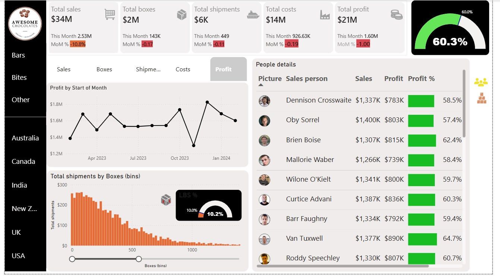

# Awesome Chocolates — Sales Analytics Power BI Report

[](https://powerbi.microsoft.com)
[]()
[]()
[]()
[]()
[]()

---

## Business Context

> **How can Awesome Chocolates' sales leadership monitor revenue, profit, operational efficiency, and individual salesperson performance across 6 countries and 22 products — with full month-over-month visibility and interactive filtering by product category and geography?**

This Power BI report transforms raw shipment data into a **7-page interactive analytics report** for Awesome Chocolates (Organic & Wholesome), a premium confectionery brand operating across APAC, Americas, and Europe. It covers financial KPIs, time-intelligence MoM comparisons, shipment efficiency analysis, and a 25-person salesperson scorecard — all driven by 30 custom DAX measures.

---

## Key Results

| KPI | Value |
|---|---|
| **Total Sales** | $34,042,511.25 |
| **Total Costs** | $13,518,440.91 |
| **Total Profit** | $20,524,070.34 |
| **Profit %** | 60.3% |
| **Total Boxes Shipped** | 2,077,844 |
| **Total Shipments** | 6,113 |
| **LBS % (Low Box Shipments)** | 10.2% (624 shipments with < 50 boxes) |
| **Date Range** | Feb 2023 – Feb 2024 (13 months) |
| **Countries** | 6 (New Zealand, Canada, Australia, India, USA, UK) |
| **Products** | 22 across Bars, Bites, Other |
| **Sales Team** | 25 people across 4 teams (Yummies, Delish, Jucies, Tempo) |

---

## Dashboard Screenshots

> 📷 **To add screenshots:** Open `sales_project_power_bi.pbix` in Power BI Desktop, screenshot each page, and upload to the repo root with the filenames shown. They will render automatically.

### Main Sales Report Dashboard


### Interactive Dashboard


---

## 🔗 Detailed Documentation — Click Any Section

| # | Section | What It Covers |
|---|---|---|
| 1 | [Dataset Description](01_project_overview.md) | All 3 Excel sheets, 22 products with costs, 25 salespeople across 4 teams, 6 geographies |
| 2 | [Report Pages](02_report_pages.md) | All 7 pages — visuals, fields, actual data tables, monthly sales by month |
| 3 | [DAX Measures](03_dax_measures.md) | All 30 measures with DAX code — SUMX, DATEADD, LASTDATE, SWITCH, DIVIDE |
| 4 | [Key Insights](04_key_insights.md) | 7 business insights with actual numbers from the dataset |
| 5 | [Power BI Techniques](05_powerbi_techniques.md) | Star schema, measure table, bookmarks, disconnected slicer, time intelligence |

---

## Top Products by Revenue

| Rank | Product | Category | Revenue |
|---|---|---|---|
| 1 | Organic Choco Syrup | Other | $2,107,156.50 |
| 2 | Peanut Butter Cubes | Bites | $2,028,631.50 |
| 3 | 99% Dark & Pure | Bars | $1,975,833.00 |
| 4 | Manuka Honey Choco | Other | $1,839,156.75 |
| 5 | Fruit & Nut Bars | Bars | $1,826,694.00 |
| 6 | After Nines | Bites | $1,823,679.00 |
| 7 | Almond Choco | Bars | $1,788,435.00 |
| 8 | Orange Choco | Bars | $1,787,726.25 |
| 9 | Smooth Silky Salty | Bars | $1,716,702.75 |
| 10 | Caramel Stuffed Bars | Bars | $1,611,429.75 |
| ... | ... | ... | ... |
| 22 | Mint Chip Choco | Bars | $880,897.50 |

---

## Sales by Geography

| Country | Region | Total Sales | Boxes | Shipments |
|---|---|---|---|---|
| New Zealand | APAC | $5,875,218.00 | 344,645 | 1,022 |
| Canada | Americas | $5,725,894.50 | 364,419 | 1,039 |
| Australia | APAC | $5,703,536.25 | 326,004 | 1,005 |
| India | APAC | $5,648,465.25 | 340,403 | 1,017 |
| USA | Americas | $5,617,462.50 | 338,068 | 1,007 |
| UK | Europe | $5,471,934.75 | 364,305 | 1,023 |

> Geographic revenue is remarkably balanced — only a $400K gap between highest (NZ $5.88M) and lowest (UK $5.47M), confirming a well-diversified sales strategy.

---

## Sales Leaderboard (Top 10)

| Rank | Sales Person | Team | Total Sales | Boxes |
|---|---|---|---|---|
| 1 | Kelci Walkden | Jucies | $1,517,602.50 | 78,720 |
| 2 | Rafaelita Blaksland | Jucies | $1,502,559.00 | 82,178 |
| 3 | Husein Augar | Delish | $1,473,072.75 | 82,673 |
| 4 | Dotty Strutley | Jucies | $1,423,993.50 | 84,955 |
| 5 | Oby Sorrel | Jucies | $1,399,738.50 | 89,886 |
| 6 | Camilla Castle | Tempo | $1,398,226.50 | 82,792 |
| 7 | Jehu Rudeforth | Tempo | $1,388,151.00 | 83,162 |
| 8 | Curtice Advani | Delish | $1,386,668.25 | 86,522 |
| 9 | Gunar Cockshoot | Yummies | $1,382,373.00 | 78,886 |
| 10 | Kaine Padly | Delish | $1,380,399.75 | 82,908 |

---

## Monthly Revenue Trend

| Month | Sales |
|---|---|
| Feb 2023 | $2,271,726.00 |
| Mar 2023 | $2,769,475.50 |
| Apr 2023 | $2,395,138.50 |
| May 2023 | $2,797,044.75 |
| Jun 2023 | $2,543,715.00 |
| Jul 2023 | $2,599,719.75 |
| Aug 2023 | $2,591,705.25 |
| Sep 2023 | $2,649,667.50 |
| Oct 2023 | $2,845,233.00 |
| Nov 2023 | $2,279,049.75 |
| **Dec 2023** | **$2,938,828.50** ← peak |
| Jan 2024 | $2,833,089.75 |
| Feb 2024 | $2,528,118.00 |

---

## Data Model

```
         calendar (394 dates: Feb 2023 – Feb 2024)
              │
              │ 1:*
              ▼
locations ──────── shipments ──────────── products
(6 countries)  (6,113 rows — FACT)   (22 products)
    1:*              │                     1:*
                     │ 1:*
                     ▼
                  people
              (25 salespeople, 4 teams)

Measure Selector  ←── disconnected helper table
_measures         ←── all 30 DAX measures
```

---

## DAX Highlights

### 30 Measures across 4 categories:

| Category | Count | Examples |
|---|---|---|
| **Core KPIs** | 8 | `Total sales` ($34M), `Profit %` (60.3%), `LBS %` (10.2%) |
| **MoM Comparison** | 10 | `MoM Sales Change %`, `Total sales (prev month)` |
| **Latest Month Snapshot** | 10 | `Total Sales Latest Month`, `Latest MoM Sales Change %` |
| **Performance Indicators** | 2 | `Profit Target Indicator`, `Profit %` |

### Key DAX Patterns:

```dax
-- Cost calculation (SUMX row iteration across shipments)
Total costs =
    SUMX(shipments, shipments[Boxes] * RELATED(products[Cost per box]))
-- Result: $13,518,440.91

-- Time intelligence (MoM comparison)
Total sales (prev month) =
    CALCULATE([Total sales], DATEADD(calendar[Date], -1, MONTH))

MoM Sales Change % =
    DIVIDE([Total sales] - [Total sales (prev month)], [Total sales (prev month)])

-- Latest month snapshot (always current regardless of filter)
Total Sales Latest Month =
    CALCULATE([Total sales], DATESMTD(LASTDATE(calendar[Date])))

-- LBS count (operational efficiency)
LBS count = CALCULATE(COUNTROWS(shipments), shipments[Boxes] < 50)
-- Result: 624 shipments (10.2%)

-- Dynamic measure toggle (SWITCH + disconnected slicer)
Selected Measure =
    SWITCH(SELECTEDVALUE('Measure Selector'[Measure Selector]),
        "Total Sales",  [Total sales],
        "Profit %",     [Profit %],
        "LBS %",        [LBS %],
        [Total sales])
```

---

## Power BI Techniques Used

| Technique | Applied For |
|---|---|
| **Star Schema** | Optimal model — fast aggregations, correct slicer propagation |
| **Dedicated `_measures` Table** | All 30 measures centralised — professional maintainability |
| **Disconnected Table** | Measure Selector — dynamic metric toggle without extra pages |
| **DATEADD Time Intelligence** | All 10 MoM comparison measures |
| **LASTDATE + DATESMTD** | 10 latest month snapshot measures |
| **SUMX** | Row-level cost calculation (Boxes × Cost per box per product) |
| **DIVIDE** | Safe division across all % measures |
| **SWITCH** | Dynamic measure selection via slicer |
| **Bookmarks** | Toggle Product Details / People Details on main dashboard |
| **Gauge Visuals** | Profit % (60.3%) and LBS % (10.2%) vs target thresholds |
| **Bins** | Box quantity distribution chart on Page 3 and Sales Report |
| **Profile Photos in Tables** | Salesperson leaderboard — 25 reps with profile images |

---

## How to Open

1. Download `sales_project_power_bi.pbix`
2. Open with **Power BI Desktop** (free — [download from Microsoft](https://powerbi.microsoft.com/desktop/))
3. All pages load with full interactivity
4. Use **Category** and **Geo** slicers to filter by product type or country
5. Use **Measure Selector** to switch the dynamic metric on the dashboard
6. Click **Product details / People details** buttons to toggle leaderboard tables

---

## Project Structure

```
awesome-chocolates-powerbi/
│
├── README.md                          ← This page
├── sales_project_power_bi.pbix        ← Full Power BI report
├── ac-sample-data.xlsx                ← Source data (3 sheets: Shipment, Dimension, Calendar)
│
├── sales_report.png                   ← Main dashboard screenshot
├── page1_kpi_summary.png
├── page2_mom_sales.png
├── page3_operational.png
├── page4_salesperson.png
├── page5_mom_operations.png
├── page6_mom_financials.png
│
└── pbi_analysis/
    ├── 01_project_overview.md         ← Dataset: 22 products, 25 people, 6 countries
    ├── 02_report_pages.md             ← All 7 pages with actual data tables
    ├── 03_dax_measures.md             ← All 30 measures with DAX code
    ├── 04_key_insights.md             ← 7 insights with real numbers
    └── 05_powerbi_techniques.md       ← Star schema, bookmarks, time intelligence
```

---

*Company: Awesome Chocolates (Organic & Wholesome)*
*Tool: Microsoft Power BI Desktop*
*Domain: FMCG Sales Analytics — Confectionery, International Distribution*
*Period: Feb 2023 – Feb 2024 | 6 Countries | 22 Products | 25 Salespeople | 6,113 Shipments*
