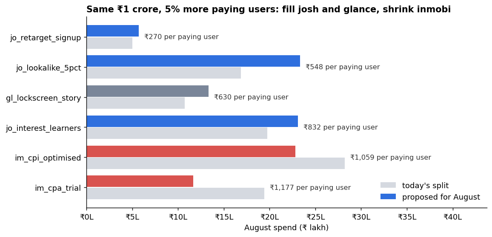
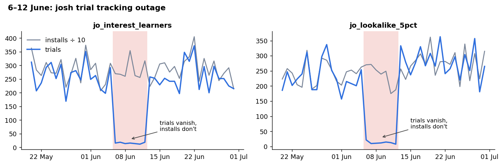
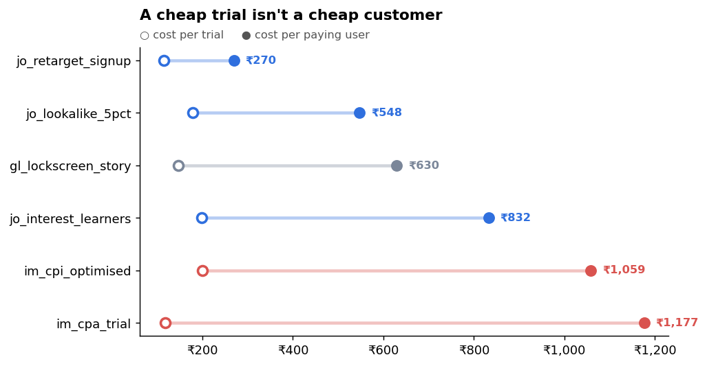
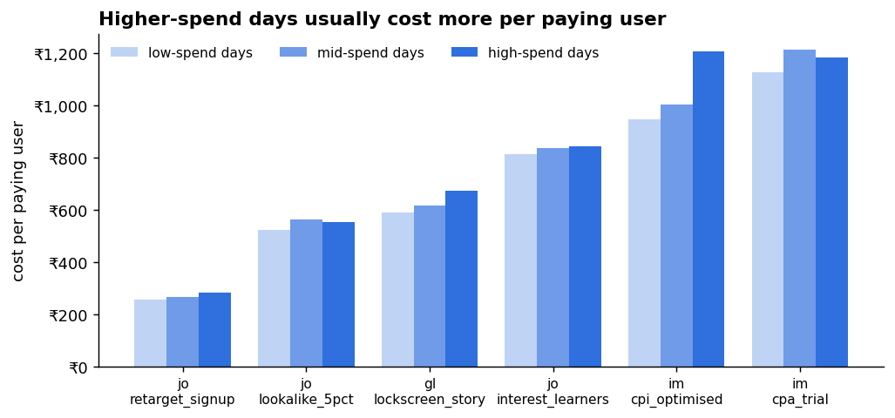
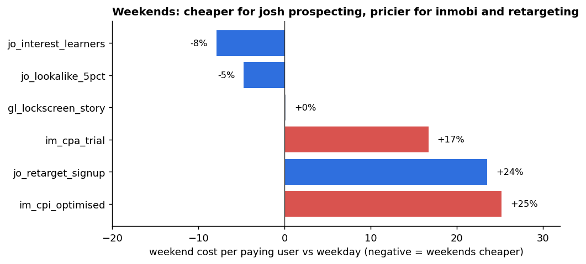

# Bolo: where should August's ₹1 crore go?

A paid-acquisition analysis for a subscription app: data quality checks, cohort-based campaign metrics, and a budget plan that accounts for diminishing returns. Python, pandas and matplotlib; no machine learning.

**Fill josh and glance to the highest spend each has been tested at and cut inmobi from 48% of the budget to 34.5%: the same ₹1 crore buys about 690 more paying users.**

## The situation
Bolo is an Android app for practising spoken English, sold to Indian users. A ₹2 trial unlocks it for 24 hours, after which a paid plan starts automatically: ₹249 a month or ₹1,499 a year. Every user comes from paid ads across three channels (josh, inmobi, glance) and six campaigns.

The growth lead has to present the August plan on Monday. The budget is ₹1 crore, about 17% above the recent run rate, and is split in rough proportion to past spend. The co-founder has noticed that some campaigns give very cheap trials, and wonders if cheap trials really mean cheap customers. Finance has also warned the budget could drop to ₹60 lakh.

## Questions
1. Can we trust the data?
2. How does each campaign really perform, from install to paying user?
3. Do cheap trials always mean cheap paying users?
4. Should spend shift between weekdays and weekends?
5. How should ₹1 crore be split in August, and what if it's cut to ₹60 lakh?
6. Which one metric should the team track every week?

## Key insights
1. **The data had three problems, fixed before any analysis.** Two josh campaigns lost their trial tracking for 7 days (6–12 June): spend and installs were normal, but trials fell almost to zero. It was spotted on 13 June, when renewals were higher than the previous day's trials, which can't happen. Glance revenue for 15–21 July included 18% GST by mistake. Inmobi spend on 22 May was counted twice.
2. **Campaigns differ a lot in cost.** One paying user costs ₹270 on the best campaign and ₹1,177 on the worst, more than 4 times as much.
3. **Cheap trials don't always mean cheap customers.** `jo_retarget_signup` has cheap trials (₹115) and cheap paying users (₹270). `im_cpa_trial` also has cheap trials (₹117), but only 10 out of 100 trial users pay, so its paying users are the most expensive (₹1,177).
4. **Inmobi gets too much of the money for what it returns.** It takes about 48% of the budget but brings the most expensive paying users.
5. **More spend gives less back.** On 5 of 6 campaigns, days with higher spend cost more per paying user. So the plan can't put all the money into the best campaign.
6. **Weekends work differently on each channel.** Josh prospecting campaigns are 5–8% cheaper per paying user on weekends; inmobi and josh retargeting are 17–25% more expensive.
7. **A better split of ₹1 crore.** More money to josh and glance, and inmobi cut from 48% to 34.5% of the budget. The same ₹1 crore brings about 690 more paying users (+5%).
8. **If the budget is cut to ₹60 lakh,** stop `im_cpa_trial`. The plan keeps 72% of paying users while spending 60% of the money.
9. **Track cost per paying user every week, not cost per trial.** Cost per trial made the worst campaign look like one of the best.
10. **What we still don't know.** The data shows only the first payment. How many users keep paying after month one decides whether spending the full ₹1 crore is worth it.

The full write-up is in [`reports/bolo_august_budget_plan.pdf`](reports/bolo_august_budget_plan.pdf): recommendation first, then evidence, then caveats.

## What's worth looking at in the method
**Finding the data problem from its symptom.** A rule check showed renewals on 13 June higher than the previous day's trials, which is impossible when renewals are charged 24 hours after a trial. Tracing back showed trials on two campaigns had fallen about 95% for a week while spend and installs stayed normal, so it was tracking, not demand. The rows are kept and flagged, and the affected trial cohorts are excluded from ratios rather than interpolated.

**Matching renewals to the right trials.** Each day's trials are paired with the next day's renewals. Dividing same-day totals understates conversion for campaigns whose spend is growing, and averaging daily ratios overstates it everywhere.

**Cheap trials versus cheap customers.**

**Diminishing returns.** High-spend days cost more per paying user on 5 of 6 campaigns. Per-campaign fits were too noisy to use, so the plan uses one shared log-log slope (0.74, standard error 0.07) and tests 0.55 and 0.90. The allocation gives each campaign money until the next paying user costs the same everywhere, and never plans a campaign outside the spend range it has actually run at.

**Weekday vs weekend**, measured by the day the trial started:

## Main caveat
The data shows only the first charge. The last paying user bought at ₹1 crore costs ₹1,411, against about ₹485 of first-month net revenue per paying user. Whether that's worth it depends on how many users keep paying after month one, which is the first thing I'd ask the product team for.

## Data
The dataset is synthetic, created for this project to behave like real subscription-app acquisition data, including the data-quality problems. All amounts are in ₹, ex-GST.

| column | meaning |
|---|---|
| `date` | day of activity (IST) |
| `channel`, `campaign` | 3 channels, 6 campaigns |
| `spend_inr` | ad spend |
| `impressions`, `clicks`, `installs` | attributed ad funnel |
| `trials` | ₹2 trials started that day |
| `renewals` | paid plans charged that day, 24 hours after the trial |
| `annual_renewals` | the part of `renewals` on the ₹1,499 annual plan |
| `revenue_inr` | gross revenue booked that day, trials included |
| `refunds_inr` | refunds and chargebacks booked that day |
