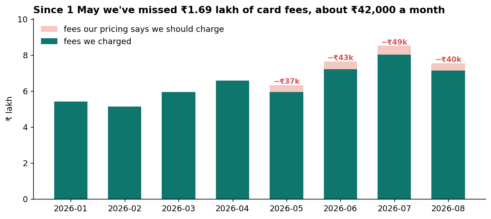
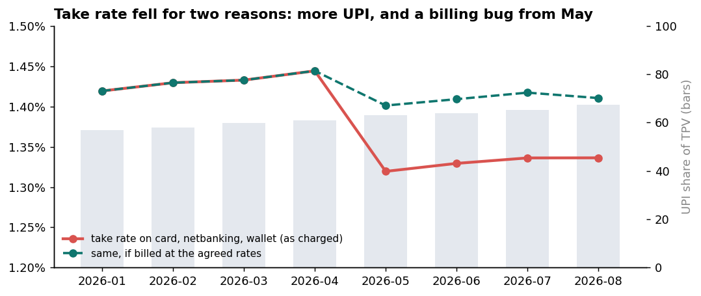
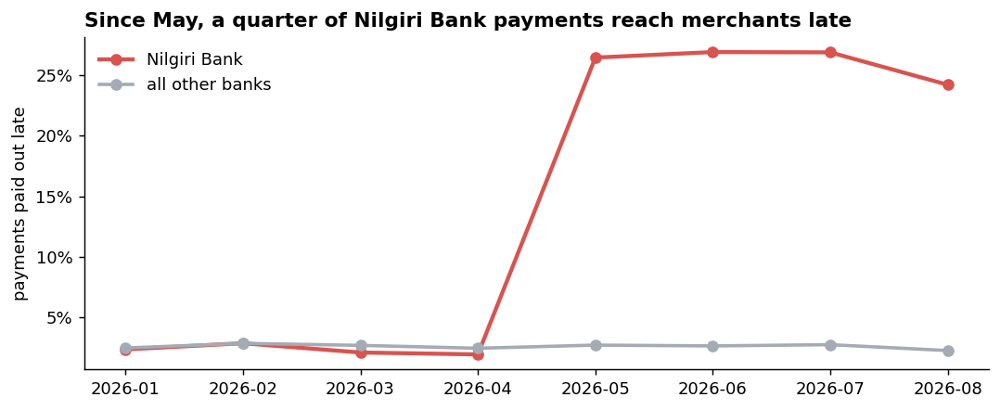
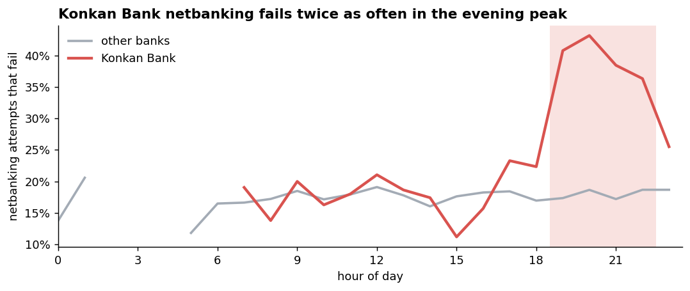
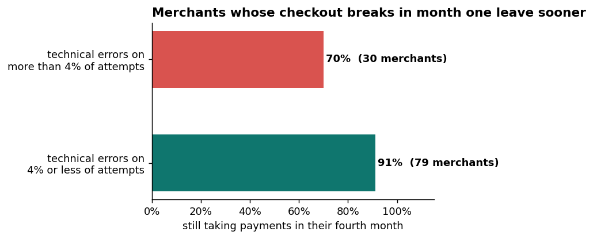
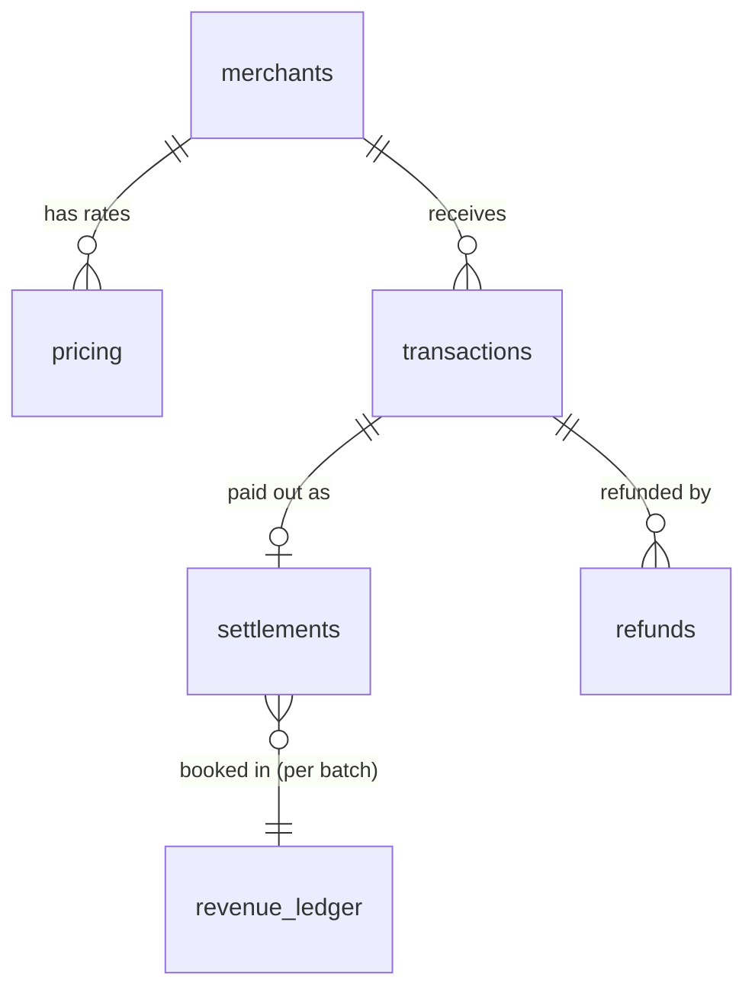

# Tarang Pay: volume doubled, revenue didn't. Where should October's one sprint go?

A payments-operations investigation for a fictional Indian payment gateway: reconciling payments, payouts, fees and finance's books, finding where money goes missing, and deciding what to fix first. **Python (pandas, matplotlib). No machine learning.**

**Fix the Growth-plan card pricing now: 85 merchants have paid ₹0 on cards since 1 May, ₹1.69 lakh so far and about ₹42,000 more every month.**

## What this project is
It has two halves, like a real take-home:
1. **The assignment:** [`brief/tarang_pay_assignment.pdf`](brief/tarang_pay_assignment.pdf), a 4-page brief with the business rules, the data dictionary, seven timed tasks, one warned trap, and how the work is judged.
2. **My solution:** the notebook, a two-page memo with an investigation log, the charts, and an honest note on how I used AI.

The company, the banks and the data are fictional. The data was generated for this project, with problems planted in it on purpose.

## Business problem
The payments operations team noticed that payment volume nearly doubled this year, from ₹8.9 crore to ₹17 crore a month, but fee revenue grew only by a third. At the same time, numbers that didn't match between systems (reconciliation differences), a spike in refunds and late payouts to merchants made leadership unsure which figures to trust before the investor update.

Tarang Pay helps online businesses accept UPI, card, netbanking and wallet payments. It keeps a fee (UPI is free; cards, netbanking and wallets aren't) and pays the rest to the merchant on the next working day.

## Main business question
> **Payment volume doubled this year, but revenue didn't. Which one fix should get October's engineering sprint?**

Engineering can give payments operations only one sprint in October, so the analysis has to end in one choice, with rupees attached. **Answer: fix the Growth-plan card pricing** (see Recommendations).

## Supporting questions
1. Can we trust the data, file by file and across files?
2. How is the business doing: volume, success rate, payment size, take rate, refunds?
3. Where do payments fail, and which failures can we fix?
4. Do payments, payouts, refunds and finance's books agree?
5. Why are some payments paid out late, or never?
6. Are we charging the right fees? Where is there potential revenue leakage?
7. Which merchants matter most, which need attention, and do they stay with us?
8. Which numbers in the current monthly report are wrong?

## Key insights
1. **Four problems in the files, and two things that only look wrong.** 184 payments (₹4.8 lakh) were paid out while recorded as failed; card fees were billed at ₹0 for 85 merchants; three days of fees (₹74,910) never reached finance's books. The August refund spike and the unpaid KYC-hold merchants look like errors but aren't.
2. **The real success rate is 93.3%, not 88.7%.** The monthly report counts every retry as a failed payment. Customers who pay on the second try are successes for the merchant.
3. **Take rate fell from 0.61% to 0.44%, mostly for a good reason.** UPI, which earns nothing, grew from 57% to 67% of payment value. But about three-quarters of the drop in card and netbanking rates since May is a billing bug.
4. **₹1.69 lakh of card fees not charged since 1 May,** about ₹42,000 a month, 5.9% of fee revenue, all from one cause: part of the Growth-plan migration set card rates to 0%.
5. **Since May, one bank delays about ₹45 lakh of payouts a month.** Nilgiri Bank sends success statuses 3–30 hours late, so about 26% of its payments miss the 23:00 cut-off and reach 773 merchants a working day late.
6. **Every unpaid successful payment has an explanation:** either its payout date falls after the data ends, or the merchant is on KYC hold.
7. **61% of failures are the customer's choice.** The fixable ones cluster at Konkan Bank netbanking in the evening (40% fail, against 18% elsewhere) and at 42 merchants with broken checkouts.
8. **The top 10% of merchants bring 83% of payment value.**
9. **Merchants whose checkout breaks in their first month leave sooner:** 70% are still active in month four, against 91%. It's a small sample (109 merchants) and not proof of cause.
10. **The sprint: fix the pricing bug first** (exact, recurring and recoverable). See Recommendations below.

## Recommendations
1. **Fix the card fee bug first. This is the sprint choice (option B).** 85 merchants have paid ₹0 on card payments since 1 May: ₹1.69 lakh lost so far, and about ₹42,000 more every month. First confirm with sales that none of these merchants were promised 0% on cards, then fix the pricing and recover the missed fees.
2. **Contact Nilgiri Bank now, and fix its integration in the next sprint (option A).** Since May, about 26% of Nilgiri Bank payments reach merchants a working day late, against about 3% at other banks. That's about ₹45 lakh of merchant payouts delayed every month, across 773 merchants, including some of the largest.
3. **Correct the monthly report before the investor update.**
   - Report success rate by order: 93.3%, not 88.7%.
   - Add the 184 payments recorded as failed but paid out to July's TPV (₹4.77 lakh).
   - Restore the missing June ledger entries (₹74,910).
   - Show refunds by the month of the original payment.
4. **Ask engineering about 1–24 July.** 184 payments were marked failed on our side, but the bank captured the money. Check whether any of those customers paid twice.
5. **Watch new merchants' checkouts.** Merchants with technical errors on more than 4% of first-month payments were less likely to still be active three months later (70% vs 91%). Check new merchants' error rates in their first two weeks.

**Headline number:** ₹1.69 lakh of card fees not charged since 1 May. It's exact, in rupees, has one cause and one owner, and grows every month the fix waits.

**Metric for the investor deck:** net take rate, shown next to UPI share. TPV rewards volume that earns nothing (two-thirds of it is UPI at 0%), and success rate doesn't connect to money.

**What would prove this wrong:** if sales did promise these merchants 0% on cards, there's nothing to recover and option B loses its value. If Nilgiri's late payouts start making large merchants leave, option A matters more.

## Charts
**Take rate fell for two reasons: more UPI (a good reason), and a billing bug from May (a bad one).** The dashed line shows what card, netbanking and wallet payments would have earned at the agreed rates.

**Since May, about a quarter of Nilgiri Bank payments reach merchants a day late.** Other banks stayed at about 3%.

**Konkan Bank netbanking fails twice as often between 7 and 11 pm.** The rest of the day, it matches other banks.

**Merchants whose checkout breaks in their first month leave sooner.** A small sample, and not proof of cause.

## Investigation log
| What I noticed | Rows and ₹ | What I think happened | Handling |
|---|---|---|---|
| Paid out, but recorded as failed | 184 payments · ₹4.77 lakh | A timeout change on our side (1–24 Jul); the bank captured the money | Flagged but kept; counted as successful |
| Card fees of ₹0 | 3,937 payments · ₹1.69 lakh not charged | Growth-plan migration set card rates to 0% for some merchants | Left alone; reported as potential leakage |
| Batches missing from the ledger | 1,177 batches · ₹74,910 | Finance's booking job didn't run on 16–18 June | Flagged |
| Nilgiri Bank payouts late | 7,781 payments since May | Bank sends success statuses hours late | Left alone; escalated |
| Refund spike, week of 24 Aug | 1,663 refunds · ₹18.6 lakh | Returns from the 7–10 Aug sale | Left alone: not an error |
| Successful payments never paid out | 738 on hold · the rest not due yet | KYC holds, and the end of the data | Left alone: not an error |

## Data model

| File | One row per | Rows |
|---|---|---|
| `merchants.csv` | merchant | 2,010 |
| `pricing.csv` | merchant × method × period a rate applies | 11,840 |
| `transactions.csv.gz` | payment attempt (several attempts can share one order) | 506,062 |
| `settlements.csv.gz` | payment paid out to a merchant | 445,917 |
| `revenue_ledger.csv.gz` | fee entry in finance's books, one per settlement batch | 72,876 |
| `refunds.csv` | refund | 13,013 |
| `calendar.csv` | day, with working-day flag and holidays | 243 |
| `monthly_report.csv` | month, as currently reported to leadership | 8 |

## Key terms
| Term | Meaning |
|---|---|
| **Order vs attempt** | One purchase can take several payment tries. The order succeeds if any try does |
| **TPV** | Total value of successful payments |
| **Take rate** | Fee revenue ÷ TPV |
| **Settlement** | Paying the merchant, the next working day (T+1) |
| **Cut-off** | A success status after 23:00 counts toward the next day |
| **MDR / fee** | What the gateway keeps; 0% on UPI |
| **Reconciliation** | Checking that two systems agree |
| **Potential leakage** | Money we should have earned but didn't, until proven lost |

## Skills shown
- **Combining six related files with pandas merges (joins),** with a check that each merge keeps the right number of rows (the price list has two prices for some merchants, which would otherwise count payments twice)
- Validation checks written as rules, with results in one table
- Choosing the right grain: orders vs attempts, payment date vs payout date
- Working-day and cut-off logic; hour-of-day patterns
- Root-cause analysis: splitting one gap into causes, each with an owner
- Cohort retention on 30-day windows
- A decision with rupees attached, and what would prove it wrong

## Caveats
- The company, banks and data are fictional; the rules in the brief are treated as true.
- "Potential leakage" stays potential until it's confirmed what the 85 merchants were promised.
- August refunds are incomplete: refunds can arrive up to 90 days after a payment.
- The retention link rests on 109 merchants and doesn't prove cause.
