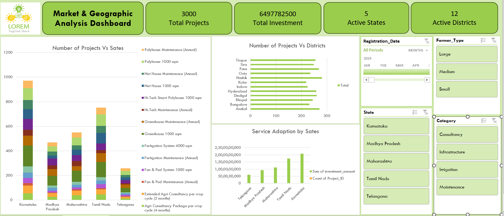
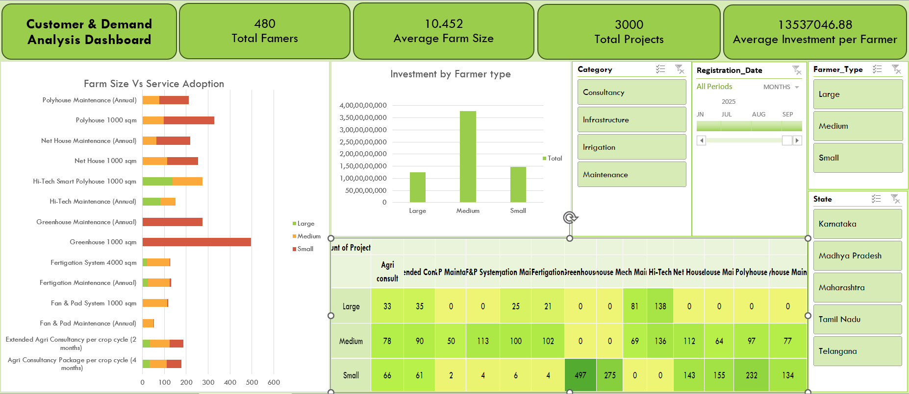

# Agri Business Analytics Dashboard (Excel Project)

## Project Overview
This project analyzes agriculture infrastructure projects, customers, and services using Microsoft Excel. The goal is to transform raw agricultural business data into meaningful insights through interactive dashboards and analytics.

The project simulates the operations of an Agri-tech consulting company providing farm infrastructure services such as polyhouses, net houses, irrigation systems, and farm management services.

Using Excel tools such as data modeling, pivot tables, calculated fields, and dashboards, the project provides insights into:

- Customer distribution
- Project investments
- Service demand
- Financial performance
- Operational efficiency

## Project Objective
The objective of this project is to:

- Analyze agricultural service demand
- Track farm infrastructure projects
- Evaluate investment trends
- Understand customer demographics
- Monitor financial performance
- Provide actionable insights for agri-business decision making

## Tools Used
- Microsoft Excel
- Pivot Tables
- Pivot Charts
- Dashboard Design
- Data Cleaning
- Business Analysis
- KPI Analysis
- Data Visualization

---

## Dataset Description

The dataset consists of three main business tables representing customers, projects, and services.

## 1. Customers Table (agri_customers)

Contains information about farmers and clients.

Key fields:

- Customer_ID
- Customer_Name
- District
- State
- Farm_Size_Acres
- Farmer_Type
- Contact_Number
- Registration Date

This dataset helps analyze:

- Customer distribution
- Farmer segments
- Customer growth trends

Farm size classification:

| Farmer Type | Land Holding  |
| ----------- | ------------- |
| Small       | 0.5 – 2 acres |
| Medium      | 2 – 5 acres   |
| Large       | 5+ acres      |

---

## 2. Projects Table (agri_projects)

Represents infrastructure or service projects executed for farmers.

Key fields include:

- Project_ID
- Customer_ID
- Service_ID
- Farm_Size
- Total_Units  
- Booking_Date
- Start_Date
- Completion_Date
- Investment_Amount
- Subsidy_Amount
- Farmer Category

Project execution timelines were simulated based on service complexity.

Example:

| Service     | Base Completion Time |
| ----------- | -------------------- |
| Polyhouse   | 28 days              |
| Fan & Pad   | 18 days              |
| Net House   | 15 days              |
| Greenhouse  | 7 days               |
| Maintenance | 1–3 days             |

This dataset helps analyze:

- Investment trends
- Project lifecycle
- Subsidy utilization
- Service demand by farmers

---

## 3. Services Table (agri_services)

Defines the infrastructure and service portfolio offered by the company.

Categories include:

| Category       | Example Services                |
| -------------- | ------------------------------- |
| Infrastructure | Polyhouse, Net House, Fan & Pad |
| Maintenance    | Annual maintenance contracts    |
| Irrigation     | Fertigation systems             |
| Consultancy    | Crop planning and advisory      |
  
Key attributes:

- Service_ID
- Service_Name
- Service_Category
- Unit_Price
- Target_season

This table enables analysis of service demand and revenue contribution.

---

## Data Preparation Process

The dataset was created through structured business logic to simulate realistic agricultural operations.

# Customer Segmentation

Farmers were categorized based on land holding:

- 53% Small Farmers
- 36% Medium Farmers
- 11% Large Farmers

Farm size determines service eligibility.

Example:

| Service           | Eligibility |
| ----------------- | ----------- |
| Polyhouse         | ≥1.5 acres  |
| Fan & Pad         | 2–4 acres   |
| Hi-Tech Polyhouse | >4 acres    |
| Fertigation       | ≥2 acres    |

---

## Service Distribution Logic

Service demand was simulated using category weight distributions:

| Category       | Distribution |
| -------------- | ------------ |
| Infrastructure | 45%          |
| Maintenance    | 27%          |
| Irrigation     | 8%           |
| Consultancy    | 20%          |

This ensures realistic business revenue mix.

---

## Investment Calculation

Investment per project was calculated using:
Investment Amount = Unit Price × Quantity

Example:

Polyhouse (₹9,00,000 per unit)

2 Units → ₹18,00,000 project investment.

---

## Government Subsidy Simulation

Government subsidy was applied based on farmer category.

| Farmer Type    | Subsidy Rate |
| -------------- | ------------ |
| Small Farmers  | 60%          |
| Medium Farmers | 50%          |
| Large Farmers  | 40%          |

Only applicable for:

- Infrastructure
- Irrigation

Consultancy and maintenance services are not subsidized.

---

## Analytical Reports

The project includes four analytical dashboards.

## 1 Market & Geographic Analysis

Purpose:

Identify regions with the highest infrastructure adoption.

Key Metrics:

- Total Investment
- Total Projects
- Active States
- Active Districts

## Analysis includes:

- State-wise investment
- District-wise project demand
- Regional service adoption patterns

Insight focus:

Identify high-potential agricultural markets.

---

## 2. Customer & Demand Analysis

Purpose:

Understand which farmer segments drive demand.

Key Metrics:

- Total Farmers
- Average Farm Size
- Total Projects
- Average Investment per Farmer

Analysis includes:

- Investment by farmer type
- Service demand by farmer segment
- Farm size vs technology adoption heatmap

Insight focus:

Understand technology adoption patterns.

## 3. Financial Performance Analysis

Purpose:

Evaluate the business revenue structure.

Key Metrics:

- Total Revenue
- Average Project Value
- Subsidy Contribution
- Infrastructure Investment Share

Analysis includes:

- Revenue mix by service category
- Subsidy distribution
- Investment vs subsidy comparison

Insight focus:

Understand profitability drivers.

---

## 4. Operational Performance Analysis

Purpose:

Evaluate project execution efficiency.

Key Metrics:

- Average Completion Time
- Fastest Services
- Longest Duration Projects
- Project Volume Trend

Analysis includes:

- Completion time by service
- Project growth over time
- Operational workload patterns

Insight focus:

Operational bottlenecks and efficiency.

---

## Dashboards Created

The project includes four interactive dashboards.

## Market Dashboard
Provides insights into market demand and service adoption.

Key metrics:

- Total Customers
- Total Projects
- Service Demand Distribution
- Monthly Project Trends

Purpose:
Understand market penetration and growth of agricultural infrastructure services.

### Insights
- Shows distribution of agricultural service demand.
- Identifies most popular infrastructure services.

---

## Customer Dashboard
Focuses on farmer demographics and segmentation.

Key insights:

- Customer distribution by category
- Farm size distribution
- Registration trends
- Farmer type analysis

Purpose:
Identify target farmer segments and growth opportunities.

### Insights
- Analysis of farmer categories and farm sizes.
- Helps identify target customer segments.

---

## Financial Dashboard
Analyzes investment and subsidy patterns.

Key metrics:

- Total Investment
- Total Subsidy
- Average Investment per Farmer
- Revenue by Service Type

Purpose:
Evaluate financial performance and subsidy impact on farm infrastructure adoption.

### Insights
- Total investment trends.
- Subsidy contribution to infrastructure projects.

---

## Operational Dashboard
Tracks project execution performance.

Key insights:

- Project completion timelines
- Service delivery performance
- Operational efficiency
- Project distribution by service

Purpose:
Improve project planning and service delivery efficiency.

### Insights
- Project completion performance.
- Service delivery efficiency.

---

## 1. Infrastructure Projects Drive Majority of Investment

Infrastructure services such as Polyhouse, Net House, Fan & Pad, and Hi-Tech Smart Polyhouse account for the largest share of total investment.

From the analysis:

- Infrastructure projects contribute ~46–50% of total investment value.
- Maintenance services contribute ~25–30%.
- Consultancy services contribute ~18–22%.
- Irrigation systems contribute ~7–10%.

Although infrastructure projects represent fewer installations compared to maintenance services, they generate significantly higher revenue due to large capital requirements.

For example:

- A Polyhouse project costs around ₹9,00,000 per unit.
- A Net House installation costs around ₹3,00,000 per unit.
- In comparison, maintenance services average ₹6,000–₹32,000 annually.

This creates a high-ticket revenue model heavily dependent on infrastructure installations.

---

## 2. Medium Farmers Contribute the Largest Share of Investment

Farmer segmentation analysis shows that medium farmers (2–5 acres) represent the most active investor segment.

Dataset distribution:

| Farmer Type | Farmers | Share |
| ----------- | ------- | ----- |
| Small       | 232     | 53%   |
| Medium      | 218     | 36%   |
| Large       | 31      | 11%   |

However, when analyzing investment contribution:

| Farmer Type | Approx Investment Share |
| ----------- | ----------------------- |
| Small       | ~28–32%                 |
| Medium      | ~48–52%                 |
| Large       | ~18–22%                 |

Even though small farmers are the majority, medium farmers generate nearly half of the total infrastructure investment.

Reason:

Medium farmers:

- Have sufficient land for infrastructure
- Can afford partial investments
- Benefit significantly from government subsidies

Thus, they represent the core revenue segment of the business.

---

## 3. Protected Cultivation Technologies Show Strong Adoption

Protected cultivation systems dominate the service demand.

Top infrastructure services:

| Service                 | Avg Investment     |
| ----------------------- | ------------------ |
| Polyhouse               | ₹9,00,000 per unit |
| Net House               | ₹3,00,000 per unit |
| Fan & Pad System        | ₹5,00,000 per unit |
| Hi-Tech Smart Polyhouse | ₹2,50,000 per unit |

Polyhouse and Net House installations together account for over 40% of infrastructure projects.

Heatmap analysis also shows:

- Small farmers prefer Greenhouses and Net Houses
- Medium farmers prefer Polyhouse and Fan & Pad systems
- Large farmers adopt Hi-Tech Polyhouses

This reflects the technology adoption curve across farm sizes.

---

## 4. Government Subsidies Significantly Reduce Farmer Investment

Subsidy policies play a crucial role in infrastructure adoption.

Subsidy structure:

| Farmer Type | Subsidy |
| ----------- | ------- |
| Small       | 60%     |
| Medium      | 50%     |
| Large       | 40%     |

Example:

Polyhouse installation:

Cost = ₹9,00,000
Small farmer subsidy = 60%
Farmer pays = ₹3,60,000
Government subsidy = ₹5,40,000

Analysis shows:

- Subsidies cover ~45–55% of infrastructure project costs overall
- Small farmers receive the largest subsidy support
- Large farmers contribute the highest direct investment
This indicates that policy support strongly drives protected cultivation adoption.

---

## 5. Operational Analysis Shows Infrastructure Projects Take Longer

Project execution analysis shows large variation in completion time.

Average completion times:

| Service              | Avg Completion |
| -------------------- | -------------- |
| Polyhouse            | ~28–35 days    |
| Fan & Pad System     | ~18–24 days    |
| Net House            | ~15–20 days    |
| Greenhouse           | ~7–10 days     |
| Maintenance Services | 1–3 days       |

Infrastructure installations take 10–15× longer than maintenance services.

This indicates:

- Higher operational complexity
- Greater labor and material dependency
- Potential project scheduling challenges

Operational dashboards show that polyhouse installations create the largest workload pressure on project teams.

---

## 6. Regional Market Demand is Uneven

State-level investment analysis shows that infrastructure adoption is concentrated in a few agricultural regions.

Example distribution:

| State          | Share of Projects |
| -------------- | ----------------- |
| Karnataka      | ~35–38%           |
| Tamil Nadu     | ~26–28%           |
| Madhya Pradesh | ~18–20%           |
| Maharashtra    | ~15–18%           |
| Telangana      | ~7–9%             |

This suggests that southern states have stronger adoption of protected cultivation technologies.

Possible reasons:

- Higher horticulture activity
- Better subsidy implementation
- Better irrigation infrastructure

---

## 7. Consultancy Services Support Long-Term Customer Engagement

Although consultancy services contribute only ~10–15% of total revenue, they play a critical role in customer engagement.

Consultancy packages include:

- Crop planning
- Nutrient management
- Yield optimization

These services often lead to future infrastructure investments such as polyhouses and fertigation systems.

Thus consultancy acts as a customer acquisition and retention strategy rather than a primary revenue driver.

---

## Key KPIs Used

- Total Farmers
- Total Projects
- Average Farm Size
- Total Investment
- Average Investment per Farmer
- Total Subsidy Support
- Service Demand Distribution

---

## Summary of Analytical Findings

1. Infrastructure projects generate the majority of company revenue.
2. Medium farmers are the most valuable customer segment.
3. Protected cultivation technologies dominate infrastructure demand.
4. Government subsidies significantly influence adoption decisions.
5. Polyhouse installations create the highest operational workload.
6. Regional adoption varies significantly across states.
7. Consultancy services help build long-term farmer relationships.

---

## Business Impact
- Helps identify high-demand services
- Improves market targeting
- Supports data-driven decision making

---

## Recommendations
- Focus marketing on high adoption farmer segments
- Expand services with high demand
- Improve project execution efficiency
